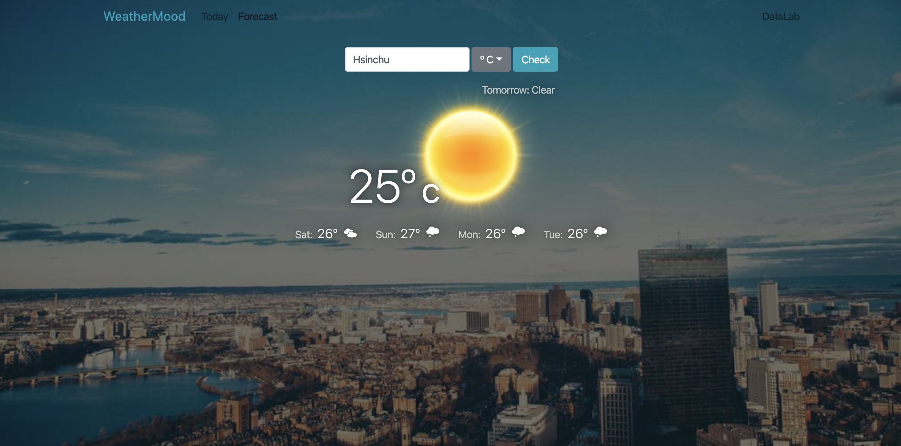

# React Weather Forecast

You can use the data in the 5 days / 3-hour api or use 16 day / daily forecast data.

If you are not using OpenWeatherMap API to get weather data, you will get 0 points.  

1. Present weather of the first day on top of the weather table correctly.
2.  Present weather of the second to the fifth day in the weather table component (total 60%)
  - Using icon from http://websygen.github.io/owfont/
  - Display weekdays (Mon, Tue, Wed, ...) correctly.
  - Display temperature correctly.
3. Responsive: Show only the second to the third day in the weather table component on portrait mobile devices.

## What to learn
Using react to build a component-based website
